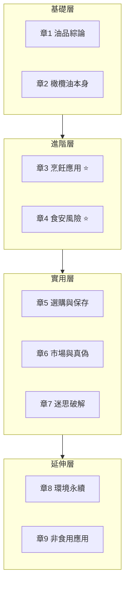
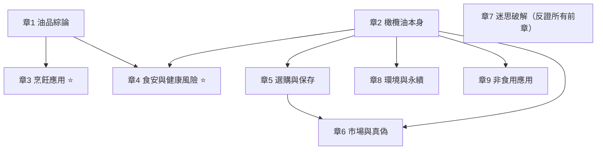

# 9 章知識地圖

## 章節分群

- **基礎層**：化學／製程／品種等底層知識，章 3-7 都會引用
- **進階層**：將基礎層轉化為「該怎麼煮」「哪些是風險」（核心應用議題）
- **實用層**：日常採買、保存、辨真假；含 TW + HK 雙脈絡
- **延伸層**：超出核心動機的相關主題；可後讀

---

## 章節依賴關係

**主要前置依賴**：
- 章 3、4 都需要章 1（脂肪酸／發煙點／氧化機制）
- 章 4 還需要章 2（橄欖油製程）
- 章 5 需要章 2（等級制度）
- 章 6 需要章 2、5（產地、品牌、進口結構）
- 章 7 是「反面教材」——所有前章的迷思反證

---

## 建議讀序（按動機分流）

### 路徑 A：想知道「日常該怎麼用油」（最快上手，~30 分鐘）
1. [[03_快速查找索引_FAQ]] —— 先看常見問題答案位置
2. [[章3_烹飪應用|章 3 烹飪應用]] —— 直接看怎麼煮（核心章）
3. [[章5_選購與保存|章 5 選購與保存]] —— 怎麼買怎麼放
4. （需要時）[[章1_油品綜論|章 1]]、[[章2_橄欖油本身|章 2]]

### 路徑 B：想搞懂「健康／致癌物的真相」（~1 小時）
1. [[章1_油品綜論|章 1 油品綜論]]（化學基礎）
2. [[章4_食安與健康風險|章 4 食安與健康風險]] ⭐
3. [[章2_橄欖油本身|章 2.6 健康效益]]（含 PREDIMED 等 RCT 證據）
4. [[章7_迷思破解|章 7 迷思破解]]

### 路徑 C：想學「怎麼辨真假／挑品牌」（~45 分鐘）
1. [[章2_橄欖油本身|章 2.2 等級制度]]
2. [[章5_選購與保存|章 5 選購與保存]]（含 TW + HK 通路品牌）
3. [[章6_市場與真偽|章 6 市場與真偽]]（含 HK 消委會案例）
4. [[章7_迷思破解|章 7 迷思破解]]

### 路徑 D：想當「橄欖油達人」（從頭讀完，~3-4 小時）
1 → 2 → 3 → 4 → 5 → 6 → 7 → 8 → 9

### 路徑 E：對「文化／永續」感興趣（~30 分鐘）
1. [[章2_橄欖油本身|章 2.1 歷史與文化]]
2. [[章8_環境與永續|章 8 環境與永續]]
3. [[章9_非食用應用|章 9 非食用應用]]

---

## 章節定位卡

| 章 | 定位 | 讀完能做 |
|---|---|---|
| **章 1 油品綜論** | 食用油的科學基礎 | 看脂肪酸比例就能預判油的耐熱性 |
| **章 2 橄欖油本身** | 橄欖油的全貌（含史、等級、品種、製程、健康、品鑑）| 看懂 EVOO 瓶身、知道為什麼健康有 RCT 背書 |
| **章 3 烹飪應用** ⭐ | 烹飪實戰指南（核心應用議題）| 每道菜選對油、油溫判斷、油炸安全 |
| **章 4 食安與健康風險** ⭐ | 油的暗黑面（核心應用議題）| 知道哪些風險真實、哪些是新聞炒作 |
| **章 5 選購與保存** | 採買與保存 SOP（TW + HK 雙脈絡）| 貨架前 30 秒判斷、知道台/港該買哪些品牌 |
| **章 6 市場與真偽** | 看懂橄欖油市場（含 HK 消委會 / 2012 mislabel 案）| 解讀義大利製、辨識假油案例 |
| **章 7 迷思破解** | 破除常見迷信（12 大迷思 + HK 補充）| 不被新聞 / KOL 誤導 |
| **章 8 環境與永續** | 永續視角（Xylella、循環經濟）| 個人採購對環境的影響評估 |
| **章 9 非食用應用** | 廚房外的橄欖油（化妝品、皂、宗教）| 辨識真 Marseille 皂、了解 squalane |

---

## 跨章節主題索引

如果關心特定主題、跨多章節，可用以下索引：

### PREDIMED 試驗
- 主要敘述：[[章2_橄欖油本身|章 2.6.1-2.6.3]]
- 延伸到失智症：[[章2_橄欖油本身|章 2.6.4]]（Tessier 2024）
- 證據強度評等：[[章2_橄欖油本身|章 2.6.7]]

### 銅葉綠素（大統假油案）
- 食安機制：[[章4_食安與健康風險|章 4.3]]
- 為什麼用顏色仿冒：[[章7_迷思破解|章 7.3]]
- 顏色不能判品質：[[章5_選購與保存|章 5.2.3]]
- 事件細節：[[章6_市場與真偽|章 6.4.2]]

### 橄欖粕油（日本一番案、HK mislabel 案）
- 化學差異：[[章2_橄欖油本身|章 2.2.2]]
- 食安風險（3-MCPD）：[[章4_食安與健康風險|章 4.2]]
- TW 案例（日本一番）：[[章6_市場與真偽|章 6.4.3]]
- HK 案例（2012 5 品牌）：[[章6_市場與真偽|章 6.5.3]]
- 迷思破解：[[章7_迷思破解|章 7.10]]

### Oleocanthal 與 Beauchamp 2005 *Nature* 發現
- 主要敘述：[[章2_橄欖油本身|章 2.6.6]]
- 化學成分：[[章2_橄欖油本身|章 2.5]]
- 感官品鑑：[[章2_橄欖油本身|章 2.7]]

### 香港食安：消委會 2022 食用油測試
- 通路與品牌：[[章5_選購與保存|章 5.5.4]]
- 市場深度：[[章6_市場與真偽|章 6.5.4]]
- 迷思（5 星 = 品質最高？）：[[章7_迷思破解|章 7.13]]

### 加熱穩定性（EVOO 能煎嗎）
- 基礎機制：[[章1_油品綜論|章 1.3.4]]
- Modern Olives Lab 2018 實證：[[章3_烹飪應用|章 3.3.1]]、[[章4_食安與健康風險|章 4.9.4]]
- 迷思破解：[[章7_迷思破解|章 7.1]]

---

## 延伸文章建議讀序（10 篇）

2026-05-28 為避免主章超載，10 個深度議題拆至 `3_延伸/` 獨立成篇。主章保留結論短段、延伸文章保有完整論述。按你的興趣切入：

### 進階深度系列（理論基礎）

| 延伸文章 | 主題 | 為什麼讀 |
|---|---|---|
| [[延伸_章1_動物油脂與飽和脂肪平反史]] | 章 1 延伸 | 想搞懂 1980-2020 飽和脂肪研究史、麥當勞改油事件、AHA vs Nutrition Coalition 立場 |
| [[延伸_章2_Blue_Zones與長壽飲食模式]] | 章 2 延伸 | 想知道藍區飲食真相、Newman 2024 統計學質疑、與 PREDIMED 證據分離 |
| [[延伸_章3_鍋氣化學與華人廚房用油史]] | 章 3 延伸 | 想搞懂鑊氣的四個高溫反應、家用 vs 商用爐物理差異、台港百年用油演變 |

### 實作指南系列（怎麼做）

| 延伸文章 | 主題 | 為什麼讀 |
|---|---|---|
| [[延伸_章3_西式料理橄欖油配對指南]] | 章 3 延伸 | 義法西希葡北非中東 7 國菜系的橄欖油搭配——做西式料理必看 |
| [[延伸_章5_大瓶分裝小瓶SOP]] | 章 5 延伸 | 想買 3L 鐵罐省錢、又怕氧化——完整 5 步驟 SOP + 氮氣保鮮 |
| [[延伸_章6_線上購買與莊園直購策略]] | 章 6 延伸 | Amazon EU 採購、莊園直購流程、警訊識別、推薦入門 + 進階莊園 |

### 深度科學系列（高階）

| 延伸文章 | 主題 | 為什麼讀 |
|---|---|---|
| [[延伸_章4_廚具與油的交互作用]] | 章 4 延伸 | 金屬催化、PTFE 熱分解、鋁離子、鑄鐵 seasoning 化學——廚具進階知識 |

### 市場與經濟系列（宏觀視角）

| 延伸文章 | 主題 | 為什麼讀 |
|---|---|---|
| [[延伸_章6_亞洲橄欖油市場]] | 章 6 延伸 | 日本小豆島 100 年史、中國隴南產區、韓國 K-Wellness、東南亞市場 |
| [[延伸_章8_氣候變遷與橄欖油價格傳導]] | 章 8 延伸 | 2022-2024 價格鏈條、IPCC 三情境預測、消費者避險策略 |

### 邊緣應用系列

| 延伸文章 | 主題 | 為什麼讀 |
|---|---|---|
| [[延伸_章9_食品工業中的橄欖油]] | 原章 9.5、後完全移至延伸 | 罐頭油浸、烘焙、嬰兒副食品、義麵披薩、起司——加工食品標示判斷 |

### 按動機推薦（延伸文章版）

- **「想搞懂為什麼大家又開始推豬油」** → 延伸_章1_動物油脂與飽和脂肪平反史
- **「我每天炒中式菜、想搞懂用什麼油最好」** → 延伸_章3_鍋氣化學與華人廚房用油史
- **「在家做義式 / 西式料理、想搭配 EVOO 風味」** → 延伸_章3_西式料理橄欖油配對指南
- **「我想買大瓶罐裝省錢、又怕氧化」** → 延伸_大瓶分裝小瓶 SOP
- **「想直接從 Amazon EU 或莊園買 EVOO」** → 延伸_章6_線上購買與莊園直購策略
- **「我關心廚房油煙與肺癌、想搞懂廚具配油」** → 延伸_章4_廚具與油的交互作用（接 [[章4_食安與健康風險#4.13]]）
- **「想知道日本、中國、韓國市場狀況」** → 延伸_章6_亞洲橄欖油市場
- **「氣候變遷對未來橄欖油價格的影響」** → 延伸_章8_氣候變遷與橄欖油價格傳導
- **「想搞懂罐頭、嬰兒副食品、加工食品標示」** → 延伸_章9_食品工業中的橄欖油
- **「想知道 Blue Zones 真相、長壽飲食是否被誇大」** → 延伸_Blue Zones 與長壽飲食模式
