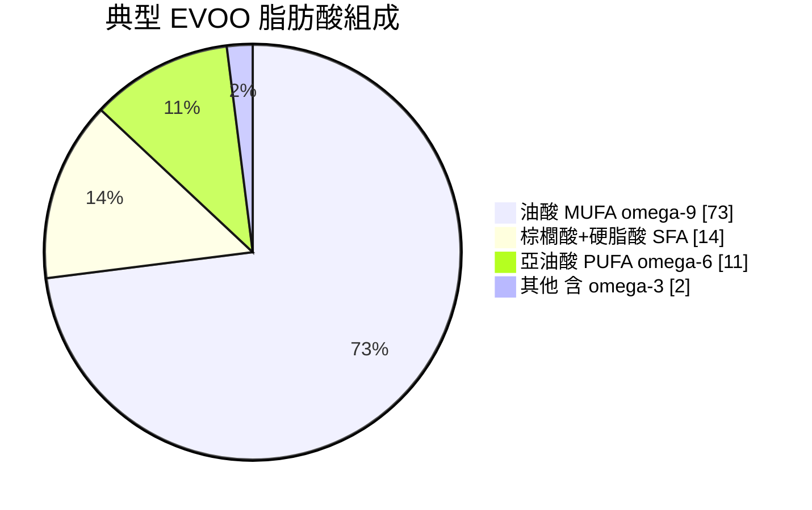

# 章 2 — 橄欖油本身

## 引言

橄欖油不是普通植物油——它是地中海文明 6000 年的核心商品，21 世紀又因 PREDIMED 等大型臨床試驗成為「以食物為藥」的代表。這章把橄欖油的全圖一次走完：從歷史脈絡開始，講等級制度的法律切點、各品種的風味基底、現代離心式製程的關鍵參數、多酚與油酸的化學組成、健康效益的臨床證據強度，最後到 IOC 感官評鑑的標準流程。

**讀完這章你會能做：**
- 看懂橄欖油瓶身的等級標示與品種來源
- 知道為什麼「EVOO 健康」這句話有真實研究背書、強度多少
- 能初步品鑑：分辨果香、苦、辛的正常表現與 rancid 等缺陷
- 為章 3 烹飪應用、章 5 選購提供概念基礎

---

## 2.1 歷史與文化

### 起源與擴散
橄欖樹的栽培史可追溯到 **公元前 4500 年的克里特島**（Minoan 文明），考古發現大量儲油陶罐與儀式遺跡。從黎凡特與愛琴海一帶出發，橄欖油沿地中海擴散到希臘、義大利、伊比利半島、北非；隨羅馬帝國版圖再進入高盧、不列顛邊緣。但實際商業規模始終以地中海盆地為核心，原因是橄欖樹對氣候（乾燥夏季 + 溫和冬季）的嚴格要求。

### 古希臘
在希臘神話裡，**雅典娜把橄欖樹作為禮物贈與雅典城**，擊敗波塞頓的鹹水泉，於是雅典以她為名。這個傳說背後是橄欖油在當時希臘社會多重核心地位的反映：

- **宗教**：神廟長明燈的燃料、祭司塗抹聖像、神諭儀式
- **體育**：奧林匹克選手賽前以油塗身，賽後刮油保留；汗油混合物（gloios）甚至被當珍貴物品出售
- **政治**：執政官、英雄頭上戴橄欖枝冠
- **日常**：化妝品基底、藥品載體、皮膚保養
- **照明**：陶燈燃料、城邦間貿易主力商品

### 古羅馬
羅馬人把橄欖油商業化推到極致。**Monte Testaccio**（羅馬一座約 50 公尺高的人造小丘）至今由 5300 萬個運過橄欖油的 amphora 陶罐碎片堆成——這是當時帝國級商品貿易的物理見證。羅馬人除了延續希臘的儀式用途，還大規模用於：

- 入葬前清潔遺體並塗油
- 公共浴場按摩
- 軍隊配給品
- 紡織業（清潔羊毛、加工皮革）

### 三大宗教
橄欖油在地中海三大一神宗教中各有獨特角色：

- **基督教**：洗禮、堅振、塗油禮（chrism）；早期教會把橄欖油視為聖物
- **猶太教**：聖殿七燈台（Menorah）用油、光明節（Hanukkah）紀念「一日油燃八日」的奇蹟
- **伊斯蘭教**：可蘭經多處提及橄欖樹為「神聖之樹」、橄欖油用於傳統醫療（先知醫學）

### 從中世紀到現代
中世紀威尼斯與熱那亞的橄欖油貿易為城市財富主要來源之一；工業革命後棉籽油、大豆油的崛起一度威脅橄欖油市場；20 世紀後半，**Ancel Keys 的「七國研究」（Seven Countries Study）與後續地中海飲食研究**讓橄欖油重新定位為「健康食品」。21 世紀的橄欖油同時是高級食材、健康訴求商品、文化象徵——三重身分讓它的定價與真偽辨識變得格外複雜（詳見章 6）。

---

## 2.2 等級制度

橄欖油的等級制度是**法律 + 化學 + 感官**三重標準的疊加，由**國際橄欖協會（International Olive Council, IOC）**主導，歐盟（EU Regulation 2568/91）與美國農業部（United States Department of Agriculture, USDA）各自有對應版本。

**台灣與香港均無自有橄欖油等級制度**——兩地依賴國際 IOC / EU 標準作為市場參考；衛福部與香港 CFS 監管聚焦在「標示與本質相符」（章 6.4、6.5），不對等級分類本身立法。

### 五大等級（IOC / EU 系統）

| 等級 | 游離酸度 | 萃取方式 | 感官缺陷 | 可直接食用 |
|---|---|---|---|---|
| **特級初榨橄欖油（Extra Virgin Olive Oil, EVOO）** | ≤ 0.8% | 純物理（≤27°C） | 0 | ✅ |
| **初榨橄欖油（Virgin Olive Oil）** | ≤ 2.0% | 純物理 | 輕微 | ✅ |
| **Lampante 油**（不可食用級的拉丁原名） | > 2.0% | 純物理 | 嚴重 | ❌ 必須精煉 |
| **精煉橄欖油（Refined Olive Oil）** | < 0.3% | 化學精煉 | 已精煉掉 | ✅ |
| **純橄欖油（Pure Olive Oil）** | ≤ 1.0% | 精煉 + 少量初榨混合 | 弱味 | ✅ |

**游離酸度（Free Acidity）** 是品質判斷的化學核心：它代表油在採收、儲存、萃取過程中三酸甘油酯被水解的程度。**酸度愈低 = 製程愈完善**（採收後迅速壓榨、無發酵、無氧化）。EVOO 法定上限 0.8%，但頂級品通常 ≤ 0.3%。

### 重要例外：橄欖粕油（Pomace Oil）

橄欖粕油（Olive-Pomace Oil）**不在上述五等級中**，因為它的萃取方式完全不同：

- 把壓榨後的固體殘渣（pomace），用**有機溶劑（hexane / 己烷）**萃取剩餘油脂
- 之後精煉脫膠、脫色、脫臭
- 製程與大豆油、葵花油等大宗植物油類似

法規允許其在標示「Olive-Pomace Oil」前提下販售，但**它不該被當作「橄欖油」販售**——這正是 2024 年台灣「日本一番」事件的核心爭議（詳見 [[章6_市場與真偽#6.4.3|章 6.4.3 日本一番案]]）。化學上，粕油的 3-MCPD esters 等精煉副產物濃度也偏高（詳見 [[章4_食安與健康風險#4.2|章 4.2 3-MCPD]]）。

> **跨章交叉**：對 Pomace Oil 的不同視角——[[章4_食安與健康風險#4.1|章 4.1 萃取階段風險]]（hexane）、[[章6_市場與真偽#6.4.3|章 6.4.3 日本一番案]] 與 [[章6_市場與真偽#6.5.3|章 6.5.3 香港 2012 mislabel 案]]（標示詐欺）、[[章7_迷思破解#7.10|章 7.10「也是橄欖油」]] 與 [[章7_迷思破解#7.17|章 7.17「工業廢油」]] 雙向迷思破解。

### 標籤多語對照

| 中文 | 義大利文 | 西班牙文 | 英文 |
|---|---|---|---|
| 特級初榨 | Olio extra vergine di oliva | Aceite de oliva virgen extra | Extra Virgin Olive Oil |
| 初榨 | Olio vergine di oliva | Aceite de oliva virgen | Virgin Olive Oil |
| 純橄欖油 | Olio di oliva | Aceite de oliva | Olive Oil / Pure |
| 橄欖粕油 | Olio di sansa di oliva | Aceite de orujo de oliva | Olive-Pomace Oil |

---

## 2.3 橄欖品種

全球商業橄欖品種超過 **1600 種**，但實際大宗生產集中在十幾個品種。**Picual 一個品種就佔全球橄欖油產量約 20-25%**，是世界最大單一品種。

### 西班牙系（全球最大產區）

- **Picual**（占全球 ~20-25%）：西班牙安達盧西亞 Jaén 區絕對主力。風味強烈：青番茄、無花果葉，明顯苦味與辛辣，多酚含量高、耐儲存。
- **Hojiblanca**：產區跨 Córdoba、Málaga、Sevilla。風味平衡，水果香加溫和苦味，常與 Picual 互補組成 blend。
- **Arbequina**（占全球 ~10%）：原產加泰隆尼亞，現在加州、阿根廷、澳洲都大量種植。風味溫和、奶油感、蘋果與杏仁香——適合不喜歡強烈苦辛的入門者。
- **Cornicabra**：以 Toledo 與 Ciudad Real 為核心，中強度風味、藥草感。

### 義大利系（小產量、品牌力強）

- **Coratina**（Apulia 普利亞）：南義主力品種之一。強苦辛、青胡椒香，**多酚含量在世界前段班**。
- **Frantoio**（Tuscany 托斯卡尼）：經典品種，朝鮮薊與青草香、優雅平衡。
- **Leccino**（Tuscany）：常與 Frantoio 互補，溫和、果香明顯。
- **Moraiolo**：強苦、高多酚，主要做為 blend 提升強度的輔助。

### 希臘系

- **Koroneiki**：占希臘橄欖種植面積 **50-60%**，是希臘出口主力。風味：青香蕉、青草、後段辛辣，多酚高。
- **Kalamata**、**Manaki** 等品種主要做食用橄欖、油用次要。

### 法國系

- **Picholine**（Provence）：法式地中海代表品種；雙用（油 + 食用橄欖），風味典雅、淡苦辛、青蘋果與杏仁香；常與 Aglandau、Salonenque 等本地品種 blend
- **Aglandau**（Provence）：高多酚法國品種、強苦辛、新鮮草本香
- **Tanche**（Nyons AOC）：法國唯一 AOC 食用 + 榨油品種、黑橄欖 + 圓潤甜感

### 葡萄牙系（地中海西緣的隱形強國）

葡萄牙是**世界第 8-9 大橄欖油生產國**（年產 12-14 萬噸、約全球 4%），但在華語圈知名度極低。主要產區 Trás-os-Montes、Alentejo、Beira Interior，**Alentejo 平原近 20 年大規模引入西班牙模式的超高密度（Super-High-Density, SHD）種植，產量翻倍**。

- **Galega Vulgar**：葡萄牙原生主力、佔全國 50% 以上；溫和果香、低苦辛、適合入門
- **Cobrançosa**：強多酚、青草與番茄葉香、苦辛中強
- **Verdeal Transmontana**：Trás-os-Montes 北部主力、強烈青香蕉風味
- **Madural**：北部品種、平衡度高
- 葡萄牙 EVOO 在國際賽事（NYIOOC、EVOOLEUM）2020 年後快速崛起；台港進口商開始引入精品莊園（如 Quinta do Casal Novo、Risca Grande）

### 加州與美國系

- **Mission**（1769 年由西班牙方濟會傳教士引入加州）：美國第一個橄欖品種、現用於 California Olive Ranch 等大廠 blend；風味溫和、適合大眾
- **Manzanillo**：原為西班牙食用品種、加州大量改作榨油用；中等強度
- **Sevillano**：果大、加州地中海風料理常用
- **Arbosana**（西班牙原產 → 加州、阿根廷、澳洲 SHD 主力）：與 Arbequina 並列現代 SHD 兩大主流；風味溫和帶杏仁

> 加州 EVOO 自 2008 年成立 COOC（California Olive Oil Council）認證後快速建立品質聲譽，**2020 年代後成為北美最高品質產區**；缺點是地震帶與長期乾旱壓力大。

### 北非系（地中海南緣、價廉物美）

北非橄欖油**佔全球產量的 15-20%**，僅次於西班牙與義大利。長期作為歐洲品牌的「隱形原料來源」（bulk supply），近年才開始建立自有品牌（詳見章 6.2.4）。

- **Chemlali**（突尼西亞）：占突尼西亞種植 80%、果小、油酸高、風味溫和略帶杏仁；耐旱耐鹽、適合北非氣候；2024 突尼西亞 €80-180M 詐欺案後，正品 Chemlali 國際聲譽提升
- **Chetoui**（突尼西亞北部）：強多酚、強苦辛、青果香；近年精品市場主推
- **Picholine Marocaine**（摩洛哥）：與法國 Picholine **不同品種、僅同名**；摩洛哥主力、佔全國 96%；中強苦辛、青草香
- **Meslala**（阿爾及利亞）：阿爾及利亞主力、平衡風味

### 中東黎凡特系

- **Souri**（黎巴嫩、敘利亞、以色列、巴勒斯坦）：世界**最古老栽培品種之一**（可追溯至公元前 3000 年）；強烈青香蕉與番茄葉、苦辛明顯；巴勒斯坦小農橄欖油近年隨 Fair Trade 進入歐美精品市場
- **Nabali**（巴勒斯坦、約旦）：耐旱、雙用品種
- **Memecik / Ayvalık**（土耳其）：土耳其兩大主力——Memecik（愛琴海岸、油用為主）、Ayvalık（北愛琴海、食用 + 油雙用）；土耳其是**世界第 4-5 大產國**（年產 20-30 萬噸）

### 其他補位

- **Manzanilla**（西班牙）：主要做食用橄欖、油用次要
- **Empeltre**（西班牙阿拉貢、巴利阿里群島）：金黃油色、堅果香、地方特色品種
- **Picudo**（西班牙安達盧西亞）：與 Picual 同產區的次級主力

### Blend vs 單一品種（Monovarietal）

- **Blend**（混合品種）：大廠主流。可平衡風味、控制成本、年產量穩定。瓶身通常不標品種、只標產地或品牌。
- **Monovarietal / Single Estate**：精品市場。可凸顯品種特色與風土（terroir），售價較高。包裝會明標品種與莊園。

對日常用：blend 性價比高；對品鑑與風味追求：monovarietal 更有趣。

---

## 2.4 製程

現代橄欖油製程已從傳統水壓式進化為**離心式連續生產**。完整流程：

### 1. 採收（Harvesting）— 10 月中至 12 月
- **早摘（Early Harvest）**：青橄欖、多酚高、風味強、產量低
- **熟摘**：紫橄欖、產量高、風味溫和、多酚較低
- **方式**：機械搖樹 + 鋪網（大廠）／人工梳採（精品莊園）
- **時間關鍵**：採收後 **12-24 小時內**必須壓榨，否則發酵風險上升

### 2. 洗果（Washing）
移除葉子、灰塵、小石。

### 3. 搗碎（Crushing）
- 傳統：石磨（granite millstones），溫和但慢
- 現代：金屬錘式（hammer mill），快速、可控

形成橄欖糊（paste），包含果肉、果皮、果核碎片。

### 4. 攪拌（Malaxation）— 關鍵步驟

橄欖糊在溫控攪拌缸中緩慢攪拌，讓微小油滴聚合成可分離的大油滴。**參數窄、影響大**：

- **溫度**：通常 22-28°C；IOC「冷壓」定義為 **≤ 27°C**
- **時間**：30-60 分鐘；研究指出 **≥ 45 分鐘**才能達到滿意萃油率
- **氧氣**：傳統開放式會加速氧化、損失多酚；現代密閉式以氮氣保護

溫度與時間的權衡：太短 → 萃油率低；太長／太熱 → 多酚與風味流失。每個莊園的「祕方」就在這幾個分鐘與度數的微調。

### 5. 離心分離（Decanter Centrifuge）
- **水平離心機**：3000-3600 rpm 高速
- 利用密度差分離固體（果渣）、水（vegetation water）、油
- **兩段式（two-phase）**：固體 + 油，較環保（廢水少）
- **三段式（three-phase）**：固體／水／油分流，可能加水（每 100 kg 糊加 20-50 L 水），萃油率高但流失部分水溶性多酚

### 6. 過濾（Filtering，可選）
- 過濾：清澈、可長存
- 未過濾（unfiltered）：保留更多風味顆粒，但保存期較短、可能沉澱

### 7. 儲存（Storage）
- 不鏽鋼槽
- 惰性氣體（氮氣）保護避免氧化
- 避光、控溫（15-18°C）
- 裝瓶前可能再經過濾

### 「冷壓」「冷萃取」「初榨」的法律差別
- **冷壓 / 冷萃取（Cold Pressed / Cold Extracted）**：製程方式，≤ 27°C
- **初榨（Virgin）**：品質等級，純物理萃取（不論溫度）
- **特級初榨（Extra Virgin）**：Virgin + 酸度 ≤ 0.8% + 無感官缺陷
- 三者非同義詞。「First Cold Pressed（第一道冷壓）」是行銷用語的舊習慣，現代離心式設備本就一次性出油，「第一道」幾乎無意義（章 7 迷思詳述）。

---

## 2.5 化學成分

### 主要成分（>99%）
- **三酸甘油酯（Triglycerides）** > 95%
- **游離脂肪酸（Free Fatty Acids，FFA）** < 2%（EVOO 法定 ≤ 0.8%）
- **水分** < 0.2%

### 脂肪酸組成（典型 EVOO）

| 脂肪酸 | 縮寫 | 比例範圍 |
|---|---|---|
| 油酸 Oleic acid | C18:1 ω-9 | **55-83%** |
| 棕櫚酸 Palmitic acid | C16:0 | 7.5-20% |
| 亞油酸 Linoleic acid | C18:2 ω-6 | 3.5-21% |
| 硬脂酸 Stearic acid | C18:0 | 0.5-5% |
| α-亞麻酸 | C18:3 ω-3 | < 1% |

**油酸（單元不飽和脂肪酸 MUFA）佔絕對多數**——這是橄欖油耐熱性、抗氧化性的化學基礎。相較於大豆油、葵花油等以多元不飽和（PUFA）為主的油，雙鍵少 → 不易氧化 → 加熱時不易產生有害醛類（詳見章 1、章 4）。

典型 EVOO 脂肪酸比例（單元不飽和為主體）：

對照：葵花油的 PUFA 約 65%、大豆油約 58%——這個「綠色 MUFA 區塊佔 ¾」的結構，正是橄欖油加熱穩定的視覺化解釋。

### 次要成分（< 2%，但決定品質）

#### 多酚（Polyphenols）— 健康效益核心
EVOO 多酚含量範圍 **50-800 mg/kg**（差距可達 16 倍）。主要成員：

- **Oleocanthal**：類 ibuprofen 的非類固醇抗發炎機制（抑制 COX-1／COX-2）；喉嚨後段的「刺辣感」就是它的標誌
- **Hydroxytyrosol**：強力心血管保護多酚，**EFSA 認可**「每天攝取 5 mg 可保護血脂免於氧化」的健康聲明
- **Tyrosol**：與 hydroxytyrosol 結構相關，抗氧化
- **Oleacein**：抗老化、抗發炎研究焦點
- **Oleuropein**：主要苦味來源；橄欖樹葉中含量更高

歐盟法規規定，**每日攝取 20 g EVOO（約 2 大匙）含 hydroxytyrosol 衍生物 ≥ 5 mg** 即可在包裝上標示「protects blood lipids from oxidative stress」健康聲明。

#### 其他次要成分
- **角鯊烯（Squalene）** 200-700 mg/100g：橄欖油的特殊三萜，跟人體皮脂組成接近（也是化妝品應用基礎，章 9）
- **生育酚（Tocopherols，維生素 E）** 12-25 mg/100g：天然抗氧化
- **植物固醇（Phytosterols）**：β-sitosterol 為主，與降 LDL 有關
- **葉綠素**（綠）、**類胡蘿蔔素**（黃）：決定顏色——但顏色與品質無直接關係（章 7 迷思）

橄欖油的顏色基於葉綠素 + 類胡蘿蔔素的比例與含量，**這也是大統假油案中銅葉綠素仿冒的著力點**——把混入棉籽油的油「染回」橄欖綠（章 4、章 6 詳述）。

---

## 2.6 健康效益

橄欖油的健康訴求**證據強度差異很大**。心血管證據最強（兩個大型 RCT 背書）、抗發炎有分子級機制、抗癌與抗失智近年也累積出強相關性研究；但「橄欖油治百病」式的訴求多停留在機制或動物層級，未完全建立因果。這節按**證據強度由強到弱**排列。

### 2.6.1 PREDIMED：地中海飲食的黃金 RCT

**PREDIMED**（Prevención con Dieta Mediterránea）是橄欖油研究的「皇冠寶石」，至今仍是少數成功用 RCT 級別證據連結「特定食材／飲食型態」與「疾病終點」的營養學試驗。

**試驗設計**
- 西班牙 11 個中心、**7,447 名**心血管高風險（但無 CVD）受試者
- 三組隨機分配：
  - 地中海飲食 + EVOO（每日 ≥ 4 大匙、無補助限量）
  - 地中海飲食 + 混合堅果（每日 30 g）
  - 控制組（低脂飲食教育）
- 中位追蹤 4.8 年
- 飲食依從性靠尿液 hydroxytyrosol 與血漿 α-亞麻酸驗證（不是只靠 self-report）

**主要終點**：MedDiet + EVOO 組相對控制組，主要心血管事件（心梗 + 中風 + 心血管死亡）**降低 30%**（HR 0.70，95% CI 0.54-0.92；絕對風險差 1.7-2.1 個百分點）。次群分析顯示**中風降幅最顯著**（HR 0.61，95% CI 0.44-0.86）——這是 PREDIMED 對個別終點唯一達到統計顯著的成分。

**劑量反應**：每天多 10 g EVOO → 心血管疾病（Cardiovascular Disease, CVD）風險 -10%、總死亡 -7%。攝取量最高三分之一者（平均 49.2 g/day）綜合風險 -25%。

**次要終點**：
- C-反應蛋白（C-Reactive Protein, CRP）顯著下降（抗發炎指標）
- 低密度脂蛋白（Low-Density Lipoprotein, LDL）氧化指標下降
- 血壓：收縮壓 -2.3 mmHg、舒張壓 -1.2 mmHg（vs 控制組）
- 心房顫動發生率降低 38%

**論文歷史**：原始 2013 NEJM；2018 因部分受試者隨機程序錯誤而撤回，**用更正後資料重新發表**（NEJM 2018），主結論不變。撤回本身對 PREDIMED 結論的**正面解讀**是：研究團隊有透明度修正錯誤再發表，反而強化了可信度。

### 2.6.2 PREDIMED-Reus：糖尿病子試驗（2011）

PREDIMED 的子試驗，專注糖尿病發生率：
- 418 名非糖尿病、心血管高風險受試者
- 中位追蹤 4 年
- **糖尿病累積發生率**：
  - MedDiet + EVOO：**10.1%**
  - MedDiet + 堅果：11.0%
  - 控制組（低脂）：**17.9%**
- 兩個地中海飲食組合併後，糖尿病風險**降低 52%**

**關鍵亮點**：這個降幅**在體重與運動量無顯著變化下達成**——意味著效應主要來自飲食組成而非熱量平衡或活動量。這對「吃 EVOO 會變胖」的迷思是一個有力反例。

### 2.6.3 PREDIMED-Plus：升級版（2024 結果）

PREDIMED-Plus（2013-2024）是 PREDIMED 的擴大版，增加**體重管理 + 運動介入**：
- 全歐洲最大營養 RCT（>200 名研究者、22 個機構）
- Spain 23 個中心、6,874 名超重／肥胖代謝症候群成人
- 介入：低熱量地中海飲食 + 阻力／有氧運動 + 行為支持
- 2024 結果：**第 2 型糖尿病發生率降低 31%**
- 平均 8% 體重減輕、腰圍 -7 cm

意義：證實**地中海飲食 + 生活型態管理**比 PREDIMED 原始版（無熱量限制）效果更廣；提供 2030 年代糖尿病預防的全人介入範本。

### 2.6.4 失智症與認知：Tessier et al. 2024（JAMA Network Open）

**研究設計**
- 兩個美國長期世代研究合併：Nurses' Health Study + Health Professionals Follow-up Study
- **92,383 名成人、追蹤 28 年**
- 主要結果指標：失智症相關死亡

**結果**
- 每日 EVOO ≥ 7 g（約半大匙）者，**失智症相關死亡風險 -28%**（HR 0.72，95% CI 0.64-0.81）
- 控制 **APOE ε4** 基因型（Alzheimer's 主要遺傳風險因子）後**結果不變**——意味著效益跨基因型有效
- 替代分析：以 EVOO 取代每日 5 g 瑪琪琳／美乃滋 → 死亡風險 -8% 至 -14%

**機制**
- Oleocanthal、hydroxytyrosol 可跨血腦屏障
- 影響澱粉樣蛋白（Aβ）聚集、tau 蛋白磷酸化
- 改善腦血管功能、降低神經發炎

**限制**：受試者多為白人專業人士，外推到一般族群需謹慎。

### 2.6.5 癌症：2022 系統性回顧與整合分析（PLoS One）

最大規模 meta-analysis（Markellos et al., 2022）：
- 45 篇研究：37 case-control（45,663 人）+ 8 cohort（929,771 人）
- **總癌症風險**：最高 vs 最低攝取組 RR **0.69（95% CI 0.62-0.77）**——整體降 31%

**個別癌症**：

| 癌症類型 | RR (95% CI) | 降幅 |
|---|---|---|
| 乳癌 | 0.67 (0.52-0.86) | -33% |
| 消化道 | 0.77 (0.66-0.89) | -23% |
| 上呼吸消化道（口、咽、喉）| 0.74 (0.60-0.91) | -26% |
| 泌尿道 | 0.46 (0.29-0.72) | -54% |

**地中海 vs 非地中海族群效應一致**——說明效益非僅來自地中海整體飲食型態，橄欖油本身有獨立貢獻。

**機制研究**
- 油酸抑制 **HER2 致癌基因**表現 → 誘導腫瘤細胞凋亡（apoptosis）
- Hydroxytyrosol 抑制血管新生（angiogenesis）
- Oleocanthal 體外實驗可選擇性殺死癌細胞——但臨床階段未確立

需注意：cohort + case-control 合併的觀察性研究**無法證明因果**；解讀為「強相關，待 RCT 驗證」較中肯。

### 2.6.6 抗發炎機制：Oleocanthal 與 Ibuprofen 的世紀發現

2005 年 *Nature* 一篇短論文徹底改變橄欖油的健康論述：**Beauchamp et al., Nature 437:45-46**。

**發現故事**
- Gary Beauchamp（Monell Chemical Senses Center）在西西里品油時注意到喉嚨後段的**特殊刺感**——與他研究的 ibuprofen 引起的喉嚨感**幾乎完全相同**
- 純化 EVOO 中的這個化合物，命名為 **oleocanthal**（oleo 橄欖 + canthus 刺 + al 醛）
- 結構與 ibuprofen 完全不同，但生物活性平行

**機制**
- Oleocanthal 在試管中**抑制環氧合酶 1（Cyclooxygenase-1, COX-1，IC₅₀ ≈ 23 μM）與環氧合酶 2（COX-2，IC₅₀ ≈ 28 μM）**
- 與 ibuprofen 同樣是非選擇性**非類固醇抗發炎藥（Non-Steroidal Anti-Inflammatory Drug, NSAID）**機制
- 每日攝取 50 g 高 oleocanthal EVOO ≈ **10% 的 ibuprofen 常規劑量**抗發炎效益

**這項發現的意義**
- 為什麼地中海飲食抗發炎**有「分子級」解釋**，不只是模糊的「健康食物」論調
- EVOO 高品質 vs 低品質的差異有了**劑量基礎**（多酚含量 50-800 mg/kg、16 倍差距）
- 商業 EVOO 不一定 oleocanthal 高——需早摘、特定品種（Coratina、Picual、Koroneiki 等）才能達到藥理級濃度
- 這是「藥用級 EVOO」概念的科學起點（high-phenolic EVOO 市場由此誕生）

### 2.6.7 非酒精性脂肪肝（NAFLD）與肝臟健康

**非酒精性脂肪肝（Non-Alcoholic Fatty Liver Disease, NAFLD）**——2023 年起國際肝病學會更名為 **MASLD（Metabolic dysfunction-Associated Steatotic Liver Disease）**，反映其代謝症候群的本質。全球患病率約 **25-30%**，亞洲城市人口（含台、港）由於高碳水、低運動、肥胖率上升，盛行率已直追歐美。

**現有最強證據**

- **PREDIMED 子分析**（Bedogni et al., 2019）：受試者中 NAFLD 指標（FLI, fatty liver index）顯著改善——MedDiet + EVOO 組相比控制組 FLI 下降 8-10 個百分點
- **Spanish RCT 2018**（Properzi et al., *Hepatology*）：48 名 NAFLD 患者隨機分配 MedDiet vs 低脂飲食 12 週，**MedDiet + EVOO 組肝臟脂肪含量（MRI-PDFF）下降 39%**，控制組僅 7%
- **2023 系統性回顧**（Akhlaghi et al., *Nutrition Reviews*）：18 RCT、>2000 受試者；MedDiet 與 EVOO 攝取均與肝臟脂肪、ALT、AST、胰島素抗性顯著改善相關

**機制**

- **降低肝臟新生脂質合成（de novo lipogenesis）**：油酸抑制 SREBP-1c 表現
- **抗發炎多酚**：hydroxytyrosol、oleocanthal 降低肝細胞 NF-κB 與 TNF-α
- **改善胰島素敏感性**：間接緩解肝臟脂肪堆積
- **減少 PUFA 氧化壓力**：以 MUFA 取代 ω-6 過量 PUFA、降低 4-HNE 等肝毒性醛類

**台港特殊脈絡**

亞洲 NAFLD 患者**「瘦的脂肪肝」（lean NAFLD）比例高於歐美**——台灣健保資料估約 1/3 NAFLD 患者 BMI < 24。原因包括基因型（PNPLA3、TM6SF2）、肌少症、傳統飲食碳水化合物比例高。**橄欖油 + MedDiet 模式在亞洲瘦型 NAFLD 的研究仍少**，但機制上可推測有效（油酸取代 ω-6、多酚抗發炎），可作為日常飲食調整的合理選項。

<!-- 2.6.8 深度段於 2026-05-28 拆至 3_延伸/、以下為精華短段；原 5 藍區詳述、Power 9、Newman 質疑分析請見延伸文章 -->

### 2.6.8 Blue Zones 與橄欖油在長壽飲食中的角色

**Blue Zones（藍區）** 是 Dan Buettner 在 2005 年提出的概念、指世界 5 個百歲人瑞比例異常高的地區（Sardinia 山區、Ikaria、Nicoya、Okinawa、Loma Linda）。**橄欖油在其中 3 個是核心脂肪來源**（Sardinia、Ikaria、Loma Linda），Sardinia Ogliastra 山區居民每日 EVOO 攝取 40-50 g、接近 PREDIMED 高劑量組。

**Newman 2024 質疑**：牛津人口統計學家對部分藍區出生資料準確性提出質疑（戶政錯誤、養老金詐欺、晚期登記等行政因素相關）——**但這不否定橄欖油本身的健康效益**。PREDIMED、PREDIMED-Plus、Tessier 2024 等 RCT 與 cohort 直接背書橄欖油與心血管／代謝／神經保護的關係，**證據獨立於 Blue Zones 統計爭議**。

**實用底線**：把 Blue Zones 當「啟發性飲食模式」而非「絕對長壽配方」——飲食 + 運動 + 社群 + 目的感的整體生活型態更靠譜；想要 EVOO 健康效益、直接看 PREDIMED 等 RCT 證據。

> **延伸閱讀**：[[延伸_章2_Blue_Zones與長壽飲食模式]] —— 5 個藍區逐一展開（Sardinia 山區人口統計、Ikaria 野菜飲食、Okinawa 八分飽、Loma Linda 素食 Adventist 研究等）、Power 9 共通原則、Newman 2024 質疑詳細分析、商業擴展（Netflix、Blue Zones LLC）影響

<!-- 原 2.6.8 完整版內容（保留歷史標記、新增討論請改延伸文章）：

**Blue Zones**（藍區）是 *National Geographic* 探險家 **Dan Buettner** 在 2005 年提出的概念，指世界上百歲人瑞比例異常高的五個地區：

| 藍區 | 國家 | 橄欖油角色 |
|---|---|---|
| **Sardinia（Ogliastra 山區）** | 義大利 | ⭐⭐⭐ 主力脂肪、地中海飲食核心 |
| **Ikaria** | 希臘 | ⭐⭐⭐ 每日大量攝取、與野菜並列主食 |
| **Nicoya Peninsula** | 哥斯大黎加 | ⭐ 非主流（玉米 + 豆類為主） |
| **Okinawa** | 日本 | ✗ 不在傳統飲食 |
| **Loma Linda（基督復臨安息日會社群）** | 美國加州 | ⭐⭐ 部分採用、植物為主飲食 |

**橄欖油在 5 個藍區中佔 3 個的核心脂肪來源**——Sardinia、Ikaria、Loma Linda（後者為植物為主、橄欖油常見於沙拉與烹飪）。

**藍區飲食的共同模式（"Power 9" 中的飲食三條）**

1. **植物為主（Plant Slant）**：95% 食物來自植物
2. **適度紅酒（Wine @ 5）**：每日 1-2 杯（Sardinia、Ikaria）
3. **80% 飽足規則（Hara Hachi Bu）**：源自沖繩、節制熱量

**Sardinia Ogliastra 在地觀察**

- 男女百歲比例 **1:1**（一般全球 1:5——男性早死）
- 主食：天然發酵酸種麵包、Pecorino 起司、橄欖油、野菜（特別是苦菜 *cicoria*、artichoke）、扁豆湯 *minestrone*
- 平均每日 EVOO 攝取 **40-50 g**（接近 PREDIMED 高劑量組）
- 山區羊牧地形 → 飲食含野菜豐富 → 多酚總攝取量極高

**重要質疑：Saul Justin Newman 2024**

牛津大學人口統計學家 **Saul Justin Newman** 於 2024 年發表分析（後獲搞笑諾貝爾人口統計學獎），對 Blue Zones 出生資料準確性提出質疑：
- 義大利 Sardinia、希臘 Ikaria 等地區百歲人瑞「集中度」與**戶政錯誤、養老金詐欺、晚期戶口登記**等行政因素高度相關
- 美國各州在 1880 年前後出生登記制度建立完整度差異也與百歲人瑞數量相關

**但這個質疑不否定地中海飲食本身的健康效益**——只是把「Blue Zones 人活到 110 歲」的故事性弱化。**PREDIMED、PREDIMED-Plus、Tessier 2024 等 RCT 與大型 cohort 仍直接背書橄欖油與心血管／代謝／神經保護的關係**——這些證據獨立於 Blue Zones 統計爭議。

**實用底線**：把 Blue Zones 當成「啟發性飲食模式」而非「絕對長壽配方」——飲食 + 運動 + 社群 + 目的感的整體生活型態，比單一食材的「神奇效應」更靠譜。
-->

### 2.6.9 攝取建議與證據強度評等

**主流共識**
- 每日 20-30 g（約 2 大匙）EVOO 為地中海飲食一部分
- PREDIMED 用量是 **≥ 4 大匙（≈ 60 g）/day**——「保護級」上限
- Tessier 失智症研究的有效門檻僅 **≥ 7 g/day**——「最低有效劑量」

**證據強度評等**

| 健康效益 | 證據等級 | 關鍵研究 |
|---|---|---|
| 心血管疾病預防 | **A**（RCT） | PREDIMED |
| 第 2 型糖尿病預防 | **A**（RCT） | PREDIMED-Reus、PREDIMED-Plus |
| 血脂改善（LDL） | **A**（多 RCT、EFSA 認可） | EFSA 健康聲明 |
| NAFLD／MASLD 改善 | **A-B**（RCT + 系統性回顧） | Properzi 2018、Akhlaghi 2023 |
| 失智症死亡風險 | B（大型 cohort） | Tessier 2024 |
| 癌症（多部位） | B（觀察性 meta-analysis） | Markellos 2022 |
| 抗發炎（CRP 下降）| B（次要終點） | PREDIMED 子分析 |
| 血壓 | B-C（次要終點） | PREDIMED |
| 神經保護機制 | C（機制 + 觀察） | 跨血腦屏障研究 |
| 整體長壽（Blue Zones）| C-D（觀察、含資料品質爭議） | Buettner *Blue Zones*；質疑：Newman 2024 |

**實用底線**
- **不要把橄欖油當藥**：效益建立在「整體飲食型態」（地中海飲食）上，單獨吃 EVOO 而其他飲食不改變，效益會大幅打折
- **高品質 EVOO 優於精煉油**：多酚含量差距可達 16 倍；用便宜精煉油等於放棄絕大多數的健康效益
- **早摘、單一品種、高苦辛**的 EVOO，oleocanthal 與其他多酚含量最高——也是健康效益最強的等級

---

## 2.7 品鑑（IOC 感官評鑑）

IOC 制定了全球橄欖油**感官評鑑的法定標準**，正式名稱為 **Organoleptic Assessment of Virgin Olive Oil**。這套標準不只是品酒儀式——它是 EVOO 等級判定的法律依據之一（化學指標 + 感官評鑑兩條都過才能標 EVOO）。

### 標準文件
- **COI/T.20/Doc. No 14/Rev. 9 (2024)**：品評員選拔、訓練、品管
- **COI/T.20/Doc. No 15/Rev. 11 (2024)**：感官分析方法
- **COI/T.20/Doc. No 5/Rev. 2 (2020)**：標準藍色品評杯規格

### 環境條件
- 室溫 20-25°C
- 油溫加熱至 28°C（最佳揮發物釋放）
- **藍色不透明玻璃杯**（避免顏色偏見——顏色與品質無關）
- 安靜、無異味、單人隔間

### 三正面屬性（Positive Attributes）

| 屬性 | 中文 | 來源 | 訊號 |
|---|---|---|---|
| Fruity | 果香 | 健康橄欖、適當熟度 | 從青草、葉、番茄到熟果 |
| Bitter | 苦味 | 多酚（oleuropein 等） | 健康指標 |
| Pungent | 辛辣 | Oleocanthal | 喉嚨後段刺感 |

三者皆以 0-10 分評等。**苦與辛是優點不是缺點**——這是大眾最常見的誤解（章 7 迷思）。

### 缺陷（Defects）

| 缺陷 | 中文 | 成因 |
|---|---|---|
| Rancid | 油耗味 | 氧化（光、熱、氧、時間） |
| Fusty | 悶味 | 採收後堆放過久發酵 |
| Musty | 霉味 | 受潮、霉菌污染 |
| Winey-vinegary | 酒醋味 | 過度發酵產生乙酸／乙醇 |
| Muddy sediment | 沉澱土味 | 未過濾、儲存不當 |
| Metallic | 金屬味 | 加工或儲存金屬接觸 |

**任一缺陷 ≥ 2.5 分 → 該油不能標示 EVOO**。

### 啜飲法（Slurping）
1. 倒少量油至杯中、單手覆蓋杯口、輕晃溫熱（手溫加熱）
2. 嗅聞：辨識果香 vs 缺陷
3. 含入少量油於口中
4. 吸氣使油霧化、附著於口腔後段
5. 體會苦、辛、果香的層次與餘韻
6. 吐出（不需吞下）

居家練習建議：同時準備 2-3 瓶不同品種或產區的 EVOO（例如 Arbequina vs Picual），對照差異最快有感。

---

## 2.8 橄欖油的「烹飪角色」（橋接到章 3）

把 2.1-2.7 的內容收斂為一個實用問題：**橄欖油在廚房裡到底適合做什麼？**

- **生食／涼拌（< 60°C）**：EVOO 全面發揮——風味、多酚、營養保留最完整
- **低中熱煎炒（120-180°C）**：EVOO 完全勝任。多酚 + MUFA 的組合使它**比 PUFA 高的精煉植物油更穩定**（章 1 詳述）
- **高熱油炸（180-220°C）**：精煉橄欖油或酪梨油較實際（EVOO 可用但風味浪費、成本高）

「EVOO 不能煎」是最廣流傳的迷思之一（章 7）。實證上：

- 2018 Modern Olives Lab 研究：EVOO 是測試的所有家用油中**極性化合物與醛類產量最少的**
- 多酚加熱會部分損失，但油酸結構穩定、抗氧化能力遠超精煉植物油

下一章（章 3 烹飪應用）會以這個基礎進入：油溫判斷、各料理的選油決策樹、油炸科學、風味配對、重複用油的安全界線。

---

## 延伸閱讀
- 章 1 — 油品綜論（脂肪酸、發煙點、氧化機制基礎）
- 章 3 — 烹飪應用（這章的下游實作）
- 章 4 — 食安與健康風險（粕油、銅葉綠素、烹飪致癌物的負面）
- 章 5 — 選購與保存（怎麼把這些知識轉成貨架前的判斷）
- 章 6 — 市場與真偽（產地、品牌、台灣脈絡）

---

## 參考來源

### 國際組織與標準
- [IOC — COI/T.20/Doc. No 14/Rev. 7 (2021)](https://www.internationaloliveoil.org/wp-content/uploads/2022/10/COI-T.20-Doc-14-REV-7-2021-EN.pdf) — 品評員選拔訓練標準（最新為 Rev. 9, 2024）
- [IOC — COI/T.20/Doc. No 15/Rev. 10 (2018)](https://www.internationaloliveoil.org/wp-content/uploads/2019/11/COI-T20-Doc.-15-REV-10-2018-Eng.pdf) — 感官分析方法（最新為 Rev. 11, 2024）
- [IOC — Standards, Methods and Guides 總覽](https://www.internationaloliveoil.org/what-we-do/chemistry-standardisation-unit/standards-and-methods/)

### 學術文獻（PREDIMED 與多酚）
- [Estruch et al. — Primary Prevention of Cardiovascular Disease with a Mediterranean Diet Supplemented with Extra-Virgin Olive Oil or Nuts (PREDIMED 2018 重發版) — NEJM](https://www.nejm.org/doi/full/10.1056/NEJMoa1800389)
- [Guasch-Ferré et al. — Olive oil intake and risk of cardiovascular disease in the PREDIMED Study — PubMed 24886626](https://pubmed.ncbi.nlm.nih.gov/24886626/)
- [Martínez-González et al. — Mediterranean Diet and Cardiovascular Health: Teachings of the PREDIMED Study — PMC4013190](https://pmc.ncbi.nlm.nih.gov/articles/PMC4013190/)
- [An Appraisal of the Oleocanthal-Rich EVOO — PMC10744258](https://www.ncbi.nlm.nih.gov/pmc/articles/PMC10744258/)
- [The Health Benefiting Mechanisms of Virgin Olive Oil Phenolic Compounds — PMC6273500](https://www.ncbi.nlm.nih.gov/pmc/articles/PMC6273500/)
- [Beauchamp et al. — Phytochemistry: ibuprofen-like activity in extra-virgin olive oil — Nature 437:45-46 (2005)](https://pubmed.ncbi.nlm.nih.gov/16136122/) — oleocanthal 與 COX 抑制機制的開創論文
- [Salas-Salvadó et al. — Reduction in the Incidence of Type 2 Diabetes With the Mediterranean Diet (PREDIMED-Reus) — Diabetes Care 2011](https://pmc.ncbi.nlm.nih.gov/articles/PMC3005482/)
- [Tessier et al. — Consumption of Olive Oil and Diet Quality and Risk of Dementia-Related Death — JAMA Network Open 2024 — PMID 38709531](https://pmc.ncbi.nlm.nih.gov/articles/PMC11074805/)
- [Markellos et al. — Olive oil intake and cancer risk: A systematic review and meta-analysis — PLoS One 2022 — PMC8751986](https://pmc.ncbi.nlm.nih.gov/articles/PMC8751986/)
- [PREDIMED-Plus 計畫官網](https://www.predimedplus.com/en/project/) — 2024 type 2 diabetes 31% 風險降幅資料來源
- [Extra-Virgin Olive Oil in Alzheimer's Disease: A Comprehensive Review — PMC10856527](https://pmc.ncbi.nlm.nih.gov/articles/PMC10856527/)
- [Influence of malaxation time on virgin olive oil — ResearchGate](https://www.researchgate.net/publication/26523802_Influence_of_malaxation_time_of_oil_extraction_yields_and_chemical_and_organoleptic_characteristics_of_virgin_olive_oil_obtained_by_a_centrifugal_decanter_at_water_saving)

### 歷史與文化
- [Healing, purification and holiness: how ancient Greeks, Romans and early Christians used olive oil — The Conversation](https://theconversation.com/healing-purification-and-holiness-how-ancient-greeks-romans-and-early-christians-used-olive-oil-267003)
- [Olives and Olive Oil in Ancient Rome — UNRV Roman History](https://www.unrv.com/economy/olives-and-olive-oil.php)

### 製程與品種
- [Olive oil extraction — Wikipedia](https://en.wikipedia.org/wiki/Olive_oil_extraction)
- [Olive oil extraction — About Olive Oil (NAOOA)](https://www.aboutoliveoil.org/olive-oil-extraction)
- [World Catalogue of Olive Varieties — IOC](https://worldolivecatalogue.internationaloliveoil.org/)
- [Koroneiki — Wikipedia](https://en.wikipedia.org/wiki/Koroneiki)

### Harvard School of Public Health（公衛權威）
- [PREDIMED Study Retraction and Republication — Harvard Nutrition Source](https://nutritionsource.hsph.harvard.edu/2018/06/22/predimed-retraction-republication/)

### NAFLD / MASLD
- [Properzi et al. — Ad libitum Mediterranean and low-fat diets both significantly reduce hepatic steatosis: A randomized controlled trial — Hepatology 2018](https://pubmed.ncbi.nlm.nih.gov/29023915/)
- [Bedogni et al. — A Mediterranean diet improves Fatty Liver Index in PREDIMED — 2019](https://pubmed.ncbi.nlm.nih.gov/30859323/)
- [Akhlaghi et al. — The role of Mediterranean diet in NAFLD: A systematic review and meta-analysis — Nutrition Reviews 2023](https://academic.oup.com/nutritionreviews/article-abstract/81/9/1071/6868569)
- [NAFLD → MASLD nomenclature change — AASLD/EASL/ALEH joint statement 2023](https://www.aasld.org/new-nafld-nomenclature)

### Blue Zones 與長壽飲食
- [Buettner — The Blue Zones: Lessons for Living Longer From the People Who've Lived the Longest — National Geographic Books 2008, 2nd ed. 2012, 3rd ed. 2023](https://www.nationalgeographic.com/books/article/the-blue-zones)
- [Pes et al. — Male longevity in Sardinia: a review of historical sources — Journal of Biosocial Science 2013](https://pubmed.ncbi.nlm.nih.gov/22014300/) — Ogliastra 男女百歲比例 1:1 來源
- [Newman — Supercentenarian and remarkable age records exhibit patterns indicative of clerical errors and pension fraud — bioRxiv 2024](https://www.biorxiv.org/content/10.1101/704080v2) — Blue Zones 出生資料品質質疑
- [Tessari & Avogaro — Olive Oil and Liver Health — review 2023](https://pmc.ncbi.nlm.nih.gov/articles/PMC10675410/)
