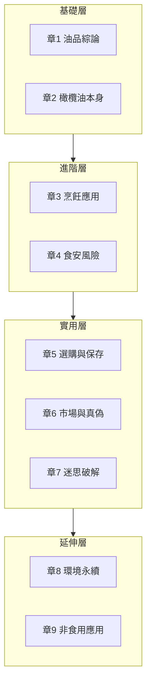

# 橄欖油應用筆記

> 一份關於**橄欖油（與其他食用油）在烹飪上的特性、選購、與食安風險**的研究筆記。
>
> 切入角度：以**烹飪應用**為核心，搭配化學機制理解，最後落實到日常採買、烹調、保存的具體判斷——不只記「該怎麼做」，更要懂「為什麼」。市場相關章節並列**台灣 + 香港**兩地脈絡。

## 先讀：五篇導論

進主章節前，建議先看這五篇打底：

| 導論 | 內容 |
|---|---|
| [[01_為什麼研究橄欖油]] | 研究動機、要回答的核心問題 |
| [[02_知識地圖]] | 9 章關係、依賴、建議讀序 |
| [[03_快速查找索引_FAQ]] | 常見問題速查（耐熱？冰箱？怎麼挑？）|
| [[04_術語表]] | EVOO、DOP、酸度、多酚、3-MCPD 等專名 |
| [[05_參考來源總表]] | 所有引用來源（IOC、UC Davis、PREDIMED、衛福部…）|

## 9 章主體

| 章 | 主題 | 重點 |
|---|---|---|
| [[章1_油品綜論]] | 油品綜論 | 脂肪酸、發煙點、氧化機制、各油種比較 |
| [[章2_橄欖油本身]] | 橄欖油本身 | 歷史、等級、品種、製程、化學、健康、品鑑 |
| [[章3_烹飪應用]] | 烹飪應用 ⭐ | 料理選油決策、油溫、操作技巧、風味配對 |
| [[章4_食安與健康風險]] | 食安與健康風險 ⭐ | 萃取階段（hexane／3-MCPD）＋ 烹飪階段（HCA／PAH／醛類）|
| [[章5_選購與保存]] | 選購與保存 | 選購四指標、認證、保存、變質辨識、台港通路品牌 |
| [[章6_市場與真偽]] | 市場與真偽 | 全球行情、產地、假油偵測、台港雙脈絡 |
| [[章7_迷思破解]] | 迷思破解 | 18+ 個常見迷思逐一拆解 |
| [[章8_環境與永續]] | 環境與永續 | 碳匯、Xylella 危機、循環經濟、Fair Trade |
| [[章9_非食用應用]] | 非食用應用 | 護膚 squalane、手工皂、宗教用油、傳統醫療 |

⭐ 為核心章。

## 延伸文章

從主章拆出、獨立成篇的深度議題：

| 延伸 | 主題 |
|---|---|
| [[延伸_章1_動物油脂與飽和脂肪平反史]] | 各油種化學 ＋ 1980–2020 飽和脂肪研究史 |
| [[延伸_章2_Blue_Zones與長壽飲食模式]] | 五大藍區 ＋ 統計學質疑 |
| [[延伸_章3_鍋氣化學與華人廚房用油史]] | 鑊氣四高溫反應 ＋ 台港百年用油演變 |
| [[延伸_章3_西式料理橄欖油配對指南]] | 義法西希葡北非中東 7 國菜系配對 |
| [[延伸_章4_廚具與油的交互作用]] | 金屬催化 ＋ 不沾鍋 ＋ 鋁離子 ＋ 鑄鐵養鍋 |
| [[延伸_章5_大瓶分裝小瓶SOP]] | 分裝 5 步驟 ＋ 氮氣保鮮 |
| [[延伸_章6_亞洲橄欖油市場]] | 日本小豆島 ＋ 中國隴南 ＋ 韓國 ＋ 東南亞 |
| [[延伸_章6_線上購買與莊園直購策略]] | Amazon EU ＋ 莊園直購 ＋ 推薦清單 |
| [[延伸_章8_氣候變遷與橄欖油價格傳導]] | 2022–2024 時間軸 ＋ IPCC 三情境 |
| [[延伸_章9_食品工業中的橄欖油]] | 罐頭 ＋ 烘焙 ＋ 嬰兒副食品 ＋ 起司 |

## 章節結構

